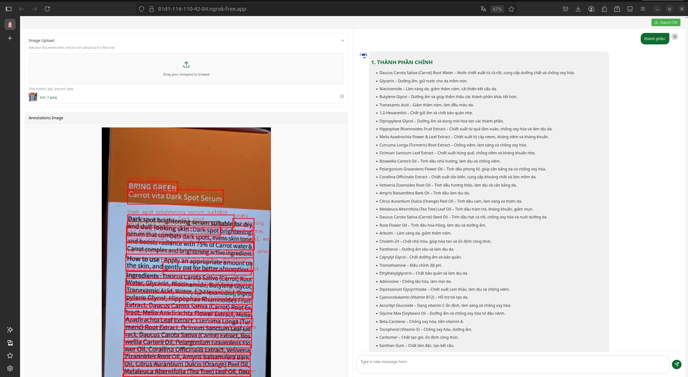
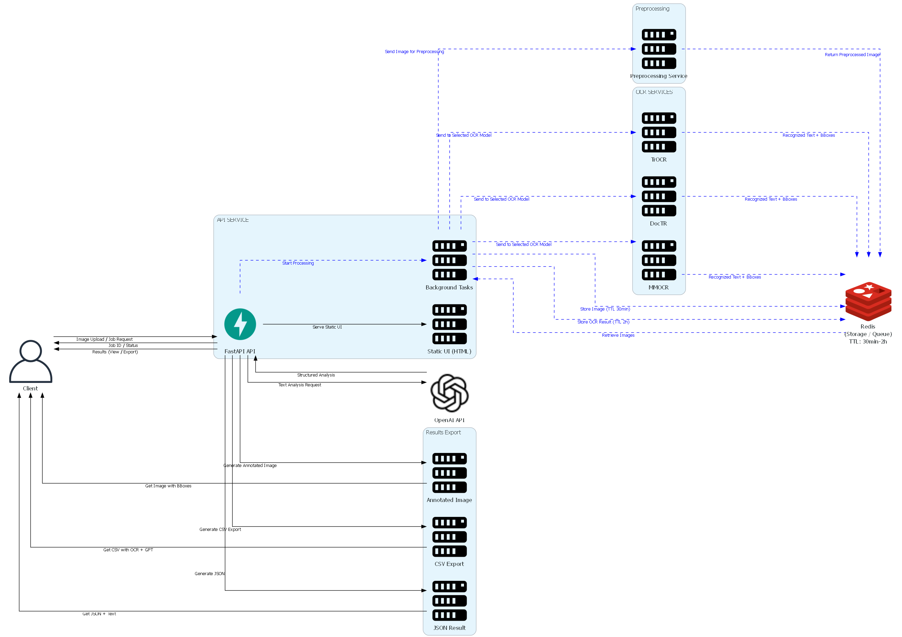

# CI-OCR: Cosmetic Ingredient OCR Pipeline System


A comprehensive OCR (Optical Character Recognition) pipeline system specifically designed for cosmetic ingredient analysis. This system combines multiple state-of-the-art OCR models with intelligent preprocessing and AI-powered analysis to extract and interpret text from cosmetic product images.

## 🌟 Features

- **Multi-Model OCR Support**: Three different OCR engines for optimal text recognition
  - **DocTR**: Document Text Recognition with high accuracy
  - **TrOCR**: Transformer-based OCR for robust text extraction
  - **MMOCR**: OpenMMLab's comprehensive OCR solution

- **Intelligent Image Preprocessing**: 
  - Background removal using REMBG
  - Text region detection with CRAFT
  - Automatic image rotation and cropping
  - Padding and optimization for OCR

- **AI-Powered Analysis**: GPT-4 integration for cosmetic ingredient analysis
  - Ingredient identification and explanation
  - Skin type compatibility assessment
  - Usage warnings and recommendations
  - Structured markdown output

- **Modern Web Interface**: 
  - Drag-and-drop image upload
  - Real-time processing status
  - Interactive results visualization
  - CSV export functionality

- **Scalable Architecture**: 
  - Microservices-based design
  - Docker containerization
  - Redis for caching and job management
  - GPU acceleration support

## 📸 Demo



## 🏗️ System Architecture



## 🚀 Quick Start

### Prerequisites

- Docker and Docker Compose
- NVIDIA GPU with CUDA support (recommended)
- At least 8GB RAM
- OpenAI API key for GPT analysis

### Installation

1. **Clone the repository**
   ```bash
   git clone https://github.com/jin0507/OCR-Cosmetic-Ingredients.git
   ```

2. **Set up environment variables**
   ```bash
   # Edit api/main.py and add your OpenAI API key
   OPENAI_API_KEY = "your-api-key-here"
   ```

3. **Build and start the system**
   ```bash
   # Using Docker Compose
   docker-compose up -d
   
   # Or using the provided script
   chmod +x run.sh
   ./run.sh start
   ```

4. **Access the application**
   Open your browser and navigate to `http://localhost:8000`

## 📦 Services

### API Gateway
- **Purpose**: Main FastAPI application serving the web interface and coordinating OCR pipeline
- **Key Features**:
  - Image upload and management
  - Job queue coordination
  - GPT integration for ingredient analysis
  - CSV export functionality

### Preprocessing Service
- **Purpose**: Image preprocessing for optimal OCR results
- **Features**:
  - Background removal with REMBG
  - Text detection using CRAFT
  - Image rotation and cropping
  - Padding addition

### DocTR Service
- **Purpose**: Document Text Recognition using DocTR
- **Features**:
  - High-accuracy text detection
  - Custom trained models
  - GPU acceleration

### TrOCR Service
- **Purpose**: Transformer-based OCR with EAST text detection
- **Features**:
  - EAST model for text detection
  - TrOCR for text recognition
  - Custom model support

### MMOCR Service
- **Purpose**: OpenMMLab OCR solution
- **Features**:
  - DBNet++ for text detection
  - ABINet for text recognition
  - Comprehensive OCR pipeline

### Redis Cache
- **Purpose**: Job queue management and image caching
- **Features**:
  - Job status tracking
  - Image storage with TTL
  - Result caching

## 🔧 Configuration

### GPU Configuration
```yaml
# docker-compose.yml
deploy:
  resources:
    reservations:
      devices:
        - driver: nvidia
          count: 1
          capabilities: [gpu]
```


## 🛠️ Management Commands

Use the provided Makefile or run.sh script for easy management:

```bash
# Start all services
make start
# or
./run.sh start

# Check service status
make status
# or
./run.sh status

# View logs
make logs
# or
./run.sh logs

# Stop all services
make stop
# or
./run.sh stop

# Clean up
make clean
# or
./run.sh stop

# Check GPU status
make check-gpu
# or
./run.sh gpu

# Check Redis connection
make check-redis
# or
./run.sh redis
```

## 🔍 Usage Workflow

1. **Upload Image**: Drag and drop or click to upload a cosmetic product image
2. **Select Model**: Choose from DocTR, TrOCR, or MMOCR based on your needs
3. **Processing**: The system automatically:
   - Preprocesses the image (background removal, rotation, etc.)
   - Runs OCR using the selected model
   - Extracts text with bounding boxes
4. **Review Results**: View extracted text and annotated image
5. **AI Analysis**: Chat with GPT to analyze ingredients and get recommendations
6. **Export**: Download results as CSV for further analysis

## 👨‍💻 Development Team
- Nguyen Hoang Anh Tuan
- Hoang Thanh Lam
- Nguyen Tran Thang

## 🙏 Acknowledgments

- [DocTR](https://github.com/mindee/doctr) for document text recognition
- [TrOCR](https://huggingface.co/microsoft/trocr-base-printed) for transformer-based OCR
- [MMOCR](https://github.com/open-mmlab/mmocr) for comprehensive OCR solutions
- [CRAFT](https://github.com/clovaai/CRAFT-pytorch) for text detection
- [REMBG](https://github.com/danielgatis/rembg) for background removal
- OpenAI for GPT integration

---

**Note**: This project is for educational purposes. The system is designed for cosmetic ingredient analysis but can be adapted for other OCR use cases by modifying the GPT prompts and analysis logic.
